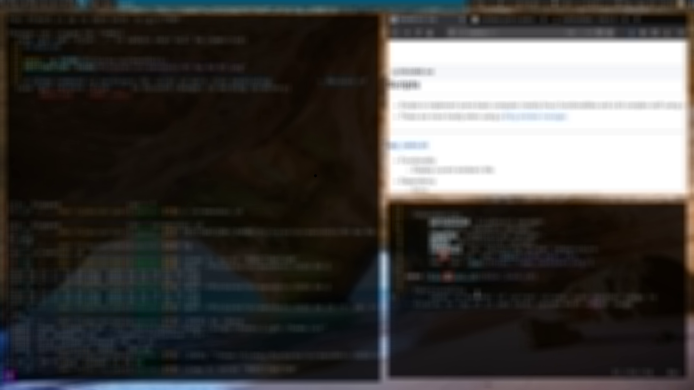

## Scripts

- Scripts to implement some basic computer (mainly linux) functionalities and a bit complex stuff using some some external programs.
- These are more handy when using a [tiling window manager](https://en.wikipedia.org/wiki/Tiling_window_manager). As a raw build of most of the tiling window mangers lacks most of the basic bindings like to change volume, brightness, turn on/off mic etc.

### How to use these?

- Clone or download this repository.
```sh
git clone https://github.com/chhajedji/scripts.git ~/.scripts	# To clone in $HOME/.scripts
```
- Append your `PATH` with `$HOME/.scripts`. Do this by adding `export PATH="$PATH:$HOME/.scripts"` in your shell's config file or `$HOME/.profile`.

```sh
echo "export PATH=\"\$PATH:\$HOME/.scripts\"" >> $HOME/.profile
```
- If you use a tiling window manager then add bindings in it's config files or for others DE's like Gnome, KDE, XFCE etc, check how can you modify keyboard shortcuts and add bindings for these scripts like you would run any normal command (`cd`, `mkdir`, etc).

> Most scripts are having an extension like `.sh` to avoid conflicts if a default command exists by that name (mostly unlikely). Also so that I know that this a script (mostly written by me) and not a command.
---

### Description

#### [app_name](app_name.sh)

- Functionality
    - Display current window's title.
    - If run from a terminal, will ask user to select which window's name to get.

- Dependency
    - None

#### [autostart](autostart.sh)

- Functionality
    - Put all your applications which needed to run after startup in this script. Applications like wallpaper, notification manager, clipboard manager, network manager etc.
    - Check if application is already running, if not then start it.
    - It will also select if HDMI is connected and set monitors for dual display using [disp_config.sh](#disp_config.sh).
    - Applications listed in _Dependencies_ are one that I use. Most of them have a check that if they are installed.

- Dependencies
    - `parcellite`: Clipboard manager.
    - `nm-applet`: Network manager.
    - `compton`: Compositing manager.
    - `dunst`: Notification manager.
    - `redshift`: For adjusting screen temperature.
    - [disp_config](#disp_config).
    - [new_wall](#new_wall).

#### [blur_lock](blur_lock.sh)

- Functionality
    - Fork of [i3lock-blur](https://github.com/petvas/i3lock-blur).
    - Takes screenshot of current screen, take another image to display on top of it and locks system with output image.
    - Sets screen timeout to a lower value when locked. After unlock, set to a higher value.

    

- Dependency
    - `xrandr`
    - `ffmpeg`
    - `i3lock`
    - [lock2.png](https://github.com/chhajedji/dot-files/blob/master/T480/.local/share/supplements/lock2.png) stored at `$HOME/.local/share/supplemets/lock2.png`.

#### [brightness_change](brightness_change.sh)

- Functionality
    - Change screen brightness.

- Dependency
    - None

#### [clickbar](clickbar.sh)

- Functionality
    - Script triggered when `dwm` status bar is clicked.

- Dependency
    - `gsimplecal`
    - [`volume_change.sh`](volume_change.sh)
    - `htop`

#### [completion](completion.bash)

- Functionality
    - Dependency for `fzf` to enable completion.
    - See https://github.com/junegunn/fzf.

- Dependency
    - `fzf`

#### [csb](csb)

- Functionality
    - Useful when working with big projects in C/C++.
    - Build cscope databases and tags using ctags and organise properly in `$HOME/.cstags_dir/`. For details see inside [csb](csb).

- Dependency
    - `ctags`
    - `cscope`

#### [dmenu_input](dmenu_input.sh)

- Functionality
    - This script includes many functionalities which can be used with `dmenu`.
    - Do a web search or go to a URL.
    - Search for manual pages.
    - Search for words in dictionary.
    - Go to git repos in your system. (This uses a file created by command `find $HOME/ -regex .*/\.git$ 2>/dev/null > $HOME/.tmp/gitfiles` to search for path of all git directories. I run this command while updating system Also there should be a directory ".tmp" in your `$HOME` directory. Check `up-to-date` command [here in dot-files repo](https://github.com/chhajedji/dot-files/blob/master/T480/.alias)).
    - Turn off notifications for specified time.
    - Connect to a WiFi network present in vicinity.
    - Quit system in multiple ways like power off, restart, suspend and logout. Not that it uses some options with `sudo` option. So make sure to either run this with `sudo` or add `pkill` and `shutdown` to sudoers.
    - Kill any process owned by same user.
    - For more details see inside [dmenu_input.sh](dmenu_input.sh).

- Dependency
    - `firefox` (If globally environmental variable `BROWSER` is unset)
    - `dict` and `dictd`: For command line dictionary.
    - `dmenu`
    - `urxvt` (If globally environmental variable `TERMINAL` is unset).
    - `dunst`/`notify-send`
    - `nmcli`
    - [`suspend_lock.sh`](suspend_lock.sh)

#### [editor](editor.sh)

- Functionality
    - Shortcut to open editor.
	- Prefered editor is `emacs`. If not installed then open in `vi`.

- Dependency
    - `emacs` (optional).
	- `Vi`.
	- `urxvt` (If globally `TERMINAL` is not set).

#### [disp_config](disp_config.sh)

- Functionality
    - Multiple screens setup for single, dual or duplicate screens.
    - Default is single monitor. See [autostart.sh](autostart.sh) which selects what to do.

- Dependency
    - `xrandr`

#### [dwmbar](dwmbar)

- Functionality
    - Display status bar with `xsetroot` when using dwm.
    - Find my dwm built _[here](https://github.com/chhajedji/dwm)_.

- Dependency
    - `amixer`

#### [filecopy](filecopy.sh)

- Functionality
    - Copy a file to clipboard from terminal and paste it somewhere other than terminal with `Ctrl-v`.

- Dependency
    - `xclip`

#### [fd](fd)

- Functionality
    - Linked to `/usr/bin/fdfind` (only for Debian).
    - See https://github.com/sharkdp/fd.

- Dependency
    - `fdfind`(https://github.com/sharkdp/fd)

#### [focus_window](focus_window.sh)

- Functionality
    - Change transparency of current widow a few times to generate visual effect to show current window being used.

- Dependency
    - `compton`

#### [gadd](gadd)

- Functionality
    - Add local files to github repos.

- Dependency
    - `git`

#### [git-open](git-open)

- Functionality
    - My fork of original [git-open](https://github.com/paulirish/git-open/).
    - Used to open github links directly. 
    - Added functionality to open my github page.

- Dependency
    - `git`

#### [git-when-merged](git-when-merged)

- Functionality
    - Helps to detect merge commit (to know when and why a commit was merged into a branch).
    - Original: [git-when-merged](https://github.com/mhagger/git-when-merged).

- Dependency
    - `git`
    - `python`

#### [i3blocks](i3blocks)

- Functionality
    - [default/](i3blocks/default) stores the default scripts when `i3blocks` is installed. These are same as scripts in `/usr/share/i3blocks/`.
    - [custom/](i3blocks/custom) store scripts with little modifications of i3blocks [default](i3blocks/default) scripts. Some modifications made which are [dwmbar](#dwmbar) compatible.


- Dependency
    - None

#### [key-bindings](key-bindings.bash)

- Functionality
    - Dependency for `fzf`.
    - Adds keybindings to change directory, reverse search and ctrl-t for completing files in current directory using `fzf`.
    - See https://github.com/junegunn/fzf.

- Dependency
    - `fzf`


#### [long-running](long-running.bash)

- Functionality
    - My fork of [undistract-me](https://github.com/jml/undistract-me).
    - Used to send notifications when a long command finishes.

- Dependency
    - [preexec](#preexec)
    - `notify-send`

#### [netspeed](netspeed)

> Not working now as Ookla changed their `speedtest` script implementation. Needs to be updated.

- Functionality
    - Check internet speed and save results in `$HOME/`.
    - First argument: Number of tests to perform. Second argument is optional to do upload speedtest also. Give anything as second argument.
    - This script will create file `downspeed` (and `upspeed` if any argument is present) and log start time, results for every iteration and average speed in it.

- Dependency
    - `speedtest-cli`

#### [new_wall](new_wall.sh)

- Functionality
    - Set a new wallpaper from files stored in given directory (and subdirectories inside).

- Dependency
    - `feh`

#### [notification_sound](notification_sound.sh)

- Functionality
    - Play notification sound.

- Dependency
    - `paplay`
    - [alert.ogg](https://github.com/chhajedji/dot-files/blob/master/T480/.local/share/supplements/alert.ogg) stored at `$HOME/.local/share/supplemets/alert.ogg`.

#### [notification_toggle](notification_toggle.sh)

- Functionality
    - Pause, resume and toggle dunst notification display. Useful when focusing on work or doing a screenshare, to avoid notifications.

- Dependency
    - `dunst`/`notify-send`

#### [o](o)

- Functionality
    - Compile given c program with `gcc` and run it. Could be helpful when running simple _C_ programs for testing _C_ functionalities, competitive programming etc.
    - Add this script in `PATH` for easy usage.
    - Just run this as `o` (if added in `PATH`) and compile and run last edited _C_ file or give name of _C_ file to be compiled and run.

- Dependency
    - `gcc`

#### [pic_lock_exec](pic_lock_exec.sh)

- Functionality
    - Lock screen with `i3lock`. Set a random background present anywhere in the given path.
    - Sets screen timeout to a lower value when locked. After unlock, set to a higher value.

- Dependency
    - `pic_lock`: See [this](#pic_lock).

#### [pic_lock](pic_lock.sh)

- Functionality
    - Locks the screen using `i3lock` with given input image.
    - A fork of [this](https://github.com/ShikherVerma/i3lock-multimonitor).

- Dependency
    - `i3lock`
    - `xrandr`

#### [power_alert](power_alert.sh)

- Functionality
    - Sends a notification when battery goes below a certain
      level. This threshold level can be set inside.

- Dependency
    - `dunst`/`notify-send`

#### [preexec](preexec.bash)

- Functionality
    - Used for [long-running](#long-running).

- Dependency
    - None

#### [restartbar](restartbar.sh)

- Functionality
    - Checks if there is any instance of "dwmbar" running.
    - If found exactly one, then kill `sleep` inside it.
    - If any instance other than one (zero, two etc.) is running, kill all instances and start a new one.

- Dependency
    - [dwmbar](#dwmbar).

#### [run](run.sh)

- Functionality
    - Used as a test script in `PATH` for testing commands/program/functionality etc.
    - Not used by system anywhere.

- Dependency
    - Variable.

#### [samedirnoob](samedirnoob.sh)

- Functionality
    - Open new terminal in same directory as of previous terminal in a more naive way.

- Dependency
    - None

#### [samedir](samedir.sh)

- Functionality
    - Same as [samedirnoob](#samedirnoob) but do it is an advanced way.
    > Note this is not always accurate but has some other benefits.

- Dependency
    - None

#### [screenkey_toggle](screenkey_toggle.sh)

- Functionality
    - Toggle screenkeys.

- Dependency
    - `screenkey`

#### [screenshot](screenshot.sh)

- Functionality
    - Take screenshots of area, whole screen and current window.
    - Save in given `$DESTINATION` and copy to clipboard.

- Dependency
    - `scrot`
    - `xclip`

#### [startpy3](startpy3.sh)

- Functionality
    - Start python3 in `$TERMINAL`.
    - Mainly used for calculator.

- Dependency
    - `python3`

#### [suspend_lock](suspend_lock.sh)

- Functionality
    - Lock screen and suspend to RAM.
    - Sets screen timeout to a lower value when locked. After unlock, set to a higher value.

- Dependency
    - `i3lock`

#### [touchpad](touchpad.sh)

- Functionality
    - Toggle touchpad with inbuilt keyboard button (if present).

- Dependency
    - `synclient`

#### [trans_change](trans_change.sh)

- Functionality
    - Change transparency of current window using `compton`.

- Dependency
    - `compton`

#### [undistract-me](undistract-me.sh)

- Functionality
    - My fork of [undistract-me](https://github.com/jml/undistract-me).
    - Used to send notifications when a long command finishes.

- Dependency
    - [long-running](#long-running)
    - [preexec](#preexec)

#### [volume_change](volume_change.sh)

- Functionality
    - Script to change system volume.
    - Also controls mic mute/unmute.

- Dependency
    - `pactl`
    - [dwmbar](#dwmbar)
    - [volume_change.ogg](https://github.com/chhajedji/dot-files/blob/master/T480/.local/share/supplements/volume_change.ogg) stored at `$HOME/.local/share/supplemets/volume_change.ogg`.

#### [wifi_toggle](wifi_toggle.sh)

- Functionality
    - Toggles WiFi connection.

- Dependency
    - `nm-applet`
